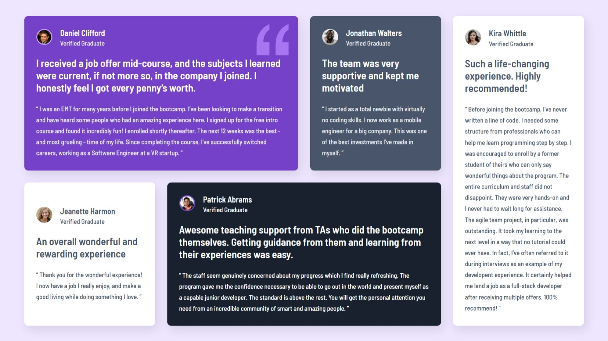

# Frontend Mentor - Four card feature section solution

This is a solution to the [Testimonials grid section challenge on Frontend Mentor](https://www.frontendmentor.io/challenges/testimonials-grid-section-Nnw6J7Un7).

## Table of contents

- [Overview](#overview)
- [Screenshot](#screenshot)
- [Links](#links)
- [Built with](#built-with)

## Overview

A testimonial grid layout built using HTML and CSS Grid.

The layout is fully responsive and adapts smoothly across screen sizes, from a single-column mobile view to a dynamic multi-column desktop grid.

### Screenshot

### Links

- Solution URL: (https://www.frontendmentor.io/solutions/a-fully-responsive-testimonials-grid-NvgH8SdYAn)
- Live Site URL: (https://testimonialsgrid1011.netlify.app/)

### Built with

- Semantic HTML5 markup
- CSS custom properties
- Flexbox
- CSS Grid
- Mobile-first workflow: with media queries for a fully responsive design
